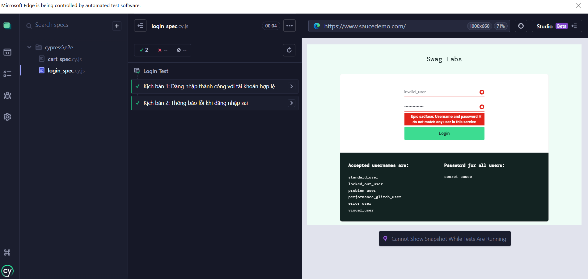
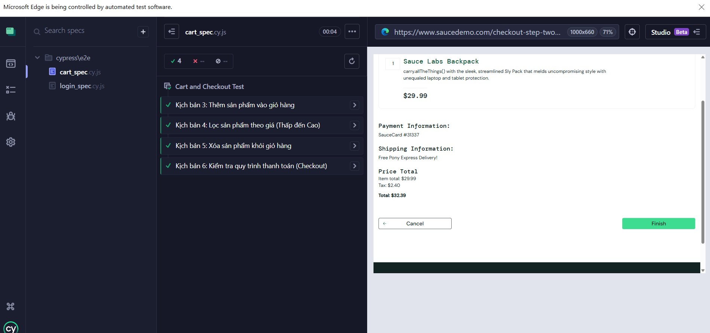

# Bài Thực Hành Tuần 3 – Cypress
## 1. Mục tiêu

- Làm quen với kiểm thử tự động trên giao diện (UI Testing)

- Hiểu cách viết và chạy các test case với Cypress

- Phân tích yêu cầu và xây dựng kịch bản kiểm thử

- Nhận thức vai trò của kiểm thử trong đảm bảo chất lượng phần mềm

## 2. Công cụ sử dụng

- Công cụ kiểm thử: Cypress

- Ngôn ngữ: JavaScript

- Trình quản lý gói: Node.js + npm

- IDE: VSCode / WebStorm

- Nền tảng quản lý mã nguồn: GitHub

## 3. Nội dung thực hiện
## 3.1 Xây dựng kịch bản kiểm thử (Test Scenario)
### Kịch bản 1 – Kiểm tra đăng nhập thành công

- Mục tiêu: xác minh người dùng đăng nhập với thông tin hợp lệ

- Kết quả mong muốn: chuyển hướng đến trang /inventory.html

### Kịch bản 2 – Kiểm tra đăng nhập thất bại

- Mục tiêu: xác minh hệ thống hiển thị lỗi khi nhập sai thông tin

- Kết quả mong muốn: hiển thị thông báo lỗi

### Kịch bản 3 – Thêm sản phẩm vào giỏ hàng

- Mục tiêu: xác minh nút “Add to cart” hoạt động đúng

- Kết quả mong muốn: badge hiển thị số 1

### Kịch bản 4 – Lọc sản phẩm theo giá tăng dần

- Mục tiêu: kiểm tra bộ lọc giá “low to high”

- Kết quả mong muốn: sản phẩm đầu tiên có giá thấp nhất

## 3.2 Cấu trúc thư mục dự án
```
/cypress
├── e2e
│    ├── login_spec.cy.js
│    └── cart_spec.cy.js
├── fixtures
└── support

cypress.config.js
package.json
README.md
```
## 3.3 Mã kiểm thử đã thực hiện

- Kịch bản kiểm thử được triển khai trong 2 file:

  - login_spec.cy.js – kiểm thử chức năng login

  - cart_spec.cy.js – kiểm thử giỏ hàng và bộ lọc

## 4. Hướng dẫn chạy kiểm thử
- npm install 
- npx cypress open
- Chọn các test trong UI Cypress để chạy.

## 5. Kết quả chạy kiểm thử




## 6. Nhận xét – Đánh giá

- Cypress hỗ trợ kiểm thử giao diện trực quan

- Giảm thời gian kiểm thử lặp lại

- Có thể quay video + chụp ảnh khi lỗi

- Giúp phát hiện sớm lỗi ở mức UI

- Việc phân tích test case giúp hiểu rõ yêu cầu người dùng

## 7. Kết luận

- Bài thực hành giúp nắm được quy trình kiểm thử tự động với Cypress

- Kỹ năng viết test case và kiểm thử UI hữu ích cho các dự án thực tế

- Việc kết hợp AI hỗ trợ sinh mã giúp tối ưu quá trình phát triển và kiểm thử phần mềm